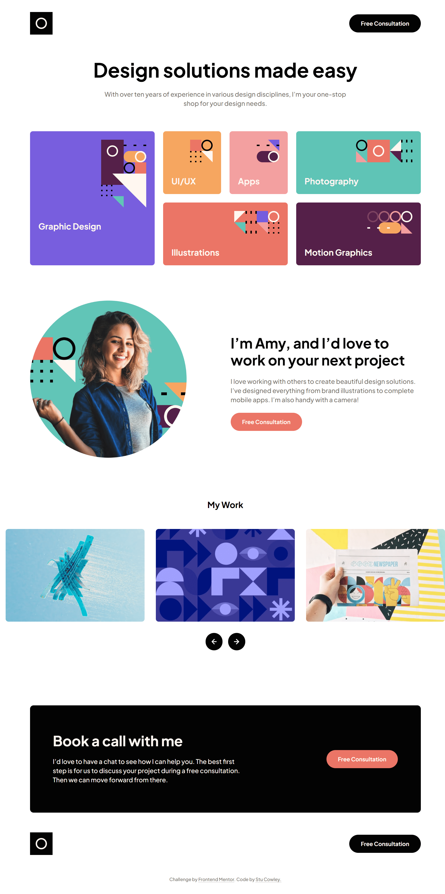

# Frontend Mentor - Single-page design portfolio solution

This is a solution to the [Single-page design portfolio challenge on Frontend Mentor](https://www.frontendmentor.io/challenges/singlepage-design-portfolio-2MMhyhfKVo). Frontend Mentor challenges help you improve your coding skills by building realistic projects.

## Table of contents

- [Overview](#overview)
  - [The challenge](#the-challenge)
  - [Screenshot](#screenshot)
  - [Links](#links)
- [My process](#my-process)
  - [Built with](#built-with)
  - [What I learned](#what-i-learned)
- [Author](#author)

**Note: Delete this note and update the table of contents based on what sections you keep.**

## Overview

### The challenge

Users should be able to:

- View the optimal layout for the site depending on their device's screen size
- See hover states for all interactive elements on the page
- Navigate the slider using either their mouse/trackpad or keyboard

### Screenshot



### Links

- Solution URL: [https://github.com/frontendstu/single-page-design-portfolio/](https://github.com/frontendstu/single-page-design-portfolio/)
- Live Site URL: [https://frontendstu.github.io/single-page-design-portfolio/](https://frontendstu.github.io/single-page-design-portfolio/)

## My process

### Built with

- Semantic HTML5 markup
- CSS custom properties
- Flexbox
- Mobile-first workflow

### What I learned

I've been away once again from frontend work and I felt I needed to sharpen my CSS/Sass skills and what a perfect project to get rid of the rust. I'm quite happy with how the layout worked along with the slider. The design of the category grid was an interesting experience and I found an exciting way of looping through each category to style the background color of each category. This is a great way of preventing the need to add multiple lines of repeating styles.

```scss
.category {
  $cat-clr: (
    "graphic-design": var(--clr-galactic-blue),
    "uiux": var(--clr-summer-yellow),
    "apps": var(--clr-pink),
    "illustrations": var(--clr-light-red),
    "photography": var(--clr-cyan),
    "motion-graphics": var(--clr-dark-purple),
  );

  @each $cat, $css-var in $cat-clr {
    &-#{$cat} {
      background-color: #{$css-var};
    }
  }

  width: 100%;
  min-width: 0;

  &-graphic-design,
  &-illustrations,
  &-photography,
  &-motion-graphics {
    grid-column: span 2;
  }

  &-uiux,
  &-apps {
    grid-column: span 1;
  }

  @media (min-width: 48em) {
    &-graphic-design {
      grid-row: span 2;
    }
  }

  @media (min-width: 80em) {
    &-photography {
      grid-column: 5/7;
      grid-row: 1;
    }
  }
}
```

## Author

- GitHub - [@frontendstu](https://github.com/frontendstu)
- Frontend Mentor - [@frontendstu](https://www.frontendmentor.io/profile/frontendstu)
